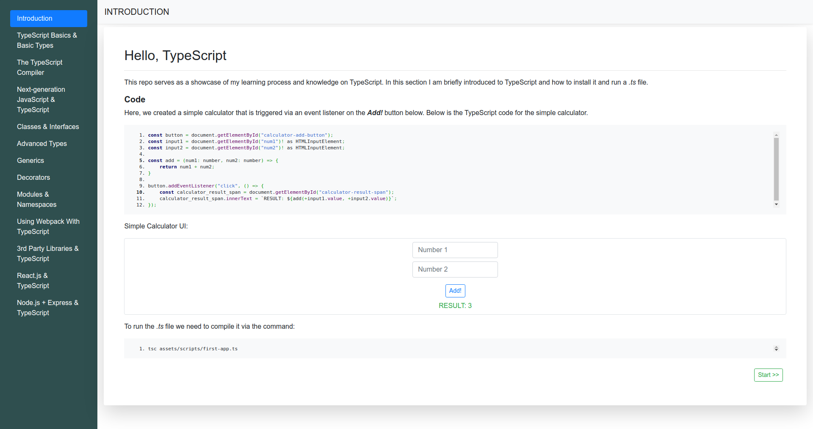

## About

### Brief

This repo demonstrates the lessons I went through while learning typescript. The purpose of learning this is to better and cleaner javascript code for both front-end and back-end. 

### Setup

Simply:
- Clone the repo 

```
git clone https://github.com/PeterKitonga/typescriptlearning.git
```
- Navigate to the project and click on the `index.html` file of a lesson

### Illustration


### Tutorial
Visit [Udemy](https://www.udemy.com/course/understanding-typescript) for the tutorial